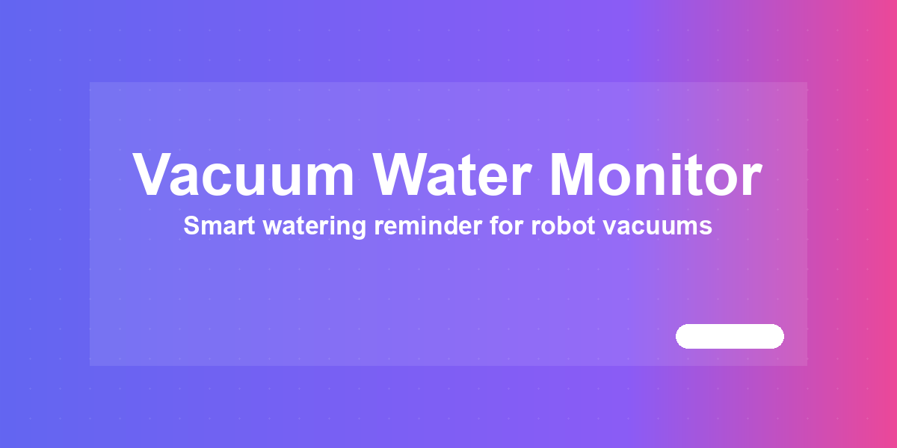

# Vacuum Water Monitor



Track robot vacuum water tank usage and refill reminders in Home Assistant.

[](https://www.home-assistant.io/) [](LICENSE) [](#changelog)

## Installation

1. Open HACS -> Custom repositories.
2. Add `https://github.com/MacSiem/ha-vacuum-water-monitor` as category **Integration**.
3. Install **Vacuum Water Monitor**.
4. Restart Home Assistant.
5. Go to Settings -> Devices & services -> Add integration, then search for **Vacuum Water Monitor**.

The integration registers the bundled Lovelace card automatically. You do not need to add a Lovelace resource manually.

## Usage

Add a manual Lovelace card:

```yaml
type: custom:ha-vacuum-water-monitor
```

Optional card settings can still be supplied in YAML:

```yaml
type: custom:ha-vacuum-water-monitor
title: Roborock
vacuum_entity: vacuum.roborock_s8_maxv_ultra
area_sensor: sensor.roborock_s8_maxv_ultra_cleaning_area
dock_error_sensor: sensor.roborock_s8_maxv_ultra_dock_error
warning_threshold: 20
critical_threshold: 10
```

### Advanced YAML — bring your own counter

If you already maintain your own water counter via a DIY template sensor or
automation (for example `input_number.roborock_water_used_ml` updated by a
`packages/roborock.yaml` automation), wire it into the card config to enable
hybrid mode. The integration will skip its own server-side accounting and
display your existing counter instead:

```yaml
type: custom:ha-vacuum-water-monitor
vacuum_entity: vacuum.roborock_s8_maxv_ultra
water_used_input: input_number.roborock_water_used_ml
water_sensor: sensor.roborock_water_remaining             # optional template
last_session_sensor: sensor.roborock_water_used_last_session_2  # optional
last_reset_entity: input_datetime.roborock_last_water_reset      # optional
```

If `water_used_input` resolves to an existing HA entity, both the server-side
tick and the card defer to your DIY setup and only render state.

## Features

- Lists Home Assistant `vacuum.*` entities through the integration WebSocket API.
- Stores tank counters, refill timestamps, card settings, maintenance items, custom calibration, and manual sessions in Home Assistant Store.
- Runs water accounting server-side every 60 seconds.
- Adds water usage when the vacuum enters known mop-wash states.
- Adds area-based water usage when cleaning area increases while the vacuum is cleaning and mopping is enabled.
- Resets tank usage when a configured tank door sensor closes or a dock `water_empty` error clears.
- Supports a manual **Refilled** button through the bundled card.
- Includes light/dark Bento-style card UI and mobile-friendly tabs.

## Upgrading from v4

v4 was a HACS Lovelace plugin. v5 is a HACS integration.

1. In HACS, remove the old frontend/plugin installation if it is still present.
2. Remove any manual Lovelace resource pointing at `/local/community/ha-vacuum-water-monitor/ha-vacuum-water-monitor.js`.
3. Add this repository back to HACS as category **Integration**.
4. Restart Home Assistant and add the integration from Devices & services.
5. Keep the same Lovelace card YAML: `type: custom:ha-vacuum-water-monitor`.

Browser-only v4 tank counters are not automatically imported. After installing v5, press **Refilled** once when the tank is full to establish the server-side baseline.

## Privacy

- No telemetry, analytics, or tracking.
- No CDN-hosted assets.
- Tank state is stored locally by Home Assistant in its normal storage area and is included in Home Assistant backups.

## Changelog

See [CHANGELOG.md](CHANGELOG.md).

## Support

- [Buy Me a Coffee](https://buymeacoffee.com/macsiem)
- [PayPal](https://www.paypal.com/donate/?hosted_button_id=Y967H4PLRBN8W)

## License

MIT, see [LICENSE](LICENSE).
