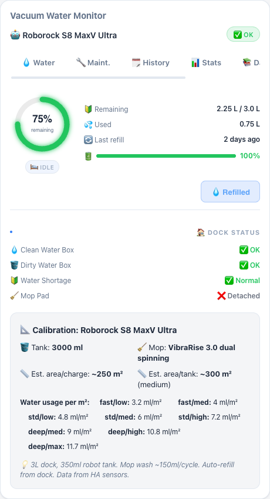
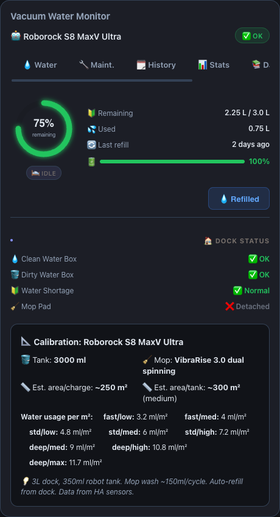
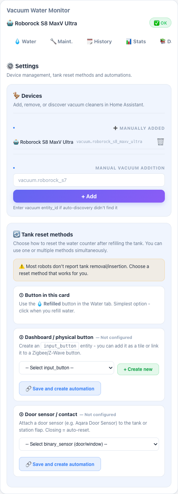

# Vacuum Water Monitor


Track how much water is left in your robot vacuum's mop water tank — and get refill
reminders — without any extra hardware. The integration estimates water usage from what
your vacuum already reports to Home Assistant (state changes and cleaned area) and exposes
it as sensors plus a bundled dashboard card.

[](https://www.home-assistant.io/) [](LICENSE) [](https://github.com/MacSiem/ha-vacuum-water-monitor/releases)

## How it works

**Short version: it works automatically.** After you install the integration and add the
card, there is nothing you have to configure — you only press **💧 Refilled** whenever you
fill the tank, so the integration knows when to start counting from 100%.

What happens under the hood:

1. **Auto-discovery.** The integration finds every `vacuum.*` entity in your Home Assistant
   and creates a device with water sensors for each robot. No YAML, no entity picking.
2. **Water accounting runs server-side, every 60 seconds.** Two signals add water usage:
   - **Mop-wash events** — when your vacuum reports a mop-washing state (e.g. Roborock's
     `washing_the_mop`), a fixed wash volume is added (default 150 mL, configurable).
   - **Cleaned area** — while the vacuum is cleaning with the mop enabled, usage is added
     per m² of newly cleaned area (rate depends on mop mode and intensity).
3. **Tank capacity comes from a built-in model database** (Roborock, Dreame, Ecovacs,
   iRobot, Narwal, Eufy, Xiaomi, Samsung and more). If your model is unknown, the sensor
   shows "unknown capacity" instead of a misleading percentage — you can set the capacity
   yourself in the card's ⚙️ Settings tab.
4. **Refills.** Press **Refilled** in the card after filling the tank. Optionally the
   counter can auto-reset when a configured tank-door sensor closes or a dock
   `water_empty` error clears.
5. **Everything is stored by Home Assistant** (Store, included in backups) — counters
   survive restarts and work across all your devices and browsers.

### What is automatic vs. manual

| Automatic | Manual (optional) |
|---|---|
| Discovering vacuums | Pressing **Refilled** after you fill the tank |
| Water usage estimation (wash events + area) | Calibrating tank size for unknown models |
| Tank capacity for known models | Wiring extra sensors (dock errors, tank door) |
| Sensors + card registration | Maintenance schedule entries |

> **Estimates, not measurements.** Robot vacuums don't report actual water level, so the
> numbers are calculated estimates. Calibration data comes from manufacturer specs and
> community measurements; you can tune everything per vacuum in the card settings.

## Screenshots

| Light | Dark |
|---|---|
|  |  |

*The Water tab: estimated tank level, usage since refill, and the Refilled button. Dark
mode follows your Home Assistant theme automatically.*



*Vacuums are auto-discovered — the ⚙️ Settings tab lets you add discovered robots, tune
calibration, and manage the maintenance schedule.*

## Installation

1. Open HACS → Custom repositories.
2. Add `https://github.com/MacSiem/ha-vacuum-water-monitor` as category **Integration**.
3. Install **Vacuum Water Monitor**.
4. Restart Home Assistant.
5. Go to Settings → Devices & services → Add integration, then search for
   **Vacuum Water Monitor**.

The integration registers the bundled Lovelace card automatically — you do not need to add
a Lovelace resource manually.

## Quick start

Add the card to any dashboard:

```yaml
type: custom:ha-vacuum-water-monitor
```

That's it. The card lists every discovered vacuum. When the tank is full, press
**💧 Refilled** once to set the baseline.

> **Tip:** add the card (or press Refilled) when the tank is actually full, so tracking is
> accurate from the start.

## Entities for automations

Each discovered vacuum gets its own device with these sensors:

| Sensor | Unit | Entity category | Meaning |
|---|---:|---|---|
| Water remaining | `%` | normal | Estimated water left in the tank |
| Water used since refill | `mL` | normal | Usage accumulated since the last refill |
| Last refill | timestamp | diagnostic | When you last pressed Refilled (or auto-reset fired) |
| Next maintenance due | `d` | diagnostic | Days until the next custom maintenance item |

Use them like any other sensor — dashboards, template sensors, and automations.

**Low-water phone notification:**

```yaml
alias: Vacuum water below 15 percent
trigger:
  - platform: numeric_state
    entity_id: sensor.roborock_s8_maxv_ultra_water_remaining
    below: 15
action:
  - service: notify.mobile_app_phone
    data:
      title: Vacuum water low
      message: >-
        {{ state_attr(trigger.entity_id, 'vacuum_entity') }} has
        {{ states(trigger.entity_id) }}% water remaining
        ({{ state_attr(trigger.entity_id, 'remaining_ml') }} mL).
mode: single
```

**Maintenance reminder:**

```yaml
alias: Vacuum maintenance due tomorrow
trigger:
  - platform: numeric_state
    entity_id: sensor.roborock_s8_maxv_ultra_next_maintenance_due
    below: 2
action:
  - service: notify.mobile_app_phone
    data:
      title: Vacuum maintenance
      message: >-
        {{ state_attr(trigger.entity_id, 'next_item') }} is due in
        {{ states(trigger.entity_id) }} day(s).
mode: single
```

## Configuration (optional)

Everything below is optional — the defaults work out of the box.

```yaml
type: custom:ha-vacuum-water-monitor
title: Roborock
vacuum_entity: vacuum.roborock_s8_maxv_ultra
area_sensor: sensor.roborock_s8_maxv_ultra_cleaning_area
dock_error_sensor: sensor.roborock_s8_maxv_ultra_dock_error
warning_threshold: 20
critical_threshold: 10
```

### Advanced — bring your own counter

If you already maintain your own water counter (DIY template sensor or automation updating
an `input_number`), wire it in and the integration will skip its own accounting and only
display your data:

```yaml
type: custom:ha-vacuum-water-monitor
vacuum_entity: vacuum.roborock_s8_maxv_ultra
water_used_input: input_number.roborock_water_used_ml
water_sensor: sensor.roborock_water_remaining              # optional template
last_session_sensor: sensor.roborock_water_used_last_session  # optional
last_reset_entity: input_datetime.roborock_last_water_reset   # optional
```

## FAQ

**Do I have to configure anything?**
No. Install → add integration → add card → press Refilled when the tank is full.

**Why is "Water remaining" unknown?**
Your model isn't in the capacity database yet. Set the tank size in the card's
⚙️ Settings → calibration (and feel free to open an issue with your model + tank size so
we can add it).

**I see two devices but I only have one vacuum.**
Either your robot is exposed by two integrations at once (e.g. the vendor integration and
Matter — each creates its own `vacuum.*` entity), or you hit a bug fixed in v5.1.7 where a
ghost "Vacuum" device could be created by the card's default config. Update and restart —
the ghost is removed automatically. If it persists, remove it in Settings →
Devices & services.

**The dock shows as a separate device in Home Assistant — does it affect this?**
No. The dock has no `vacuum.*` entity and is ignored by this integration.

**How accurate is it?**
It's an estimate based on wash cycles and cleaned area. For typical mopping runs it tracks
well within a refill cycle; you can tune mL/m², intensity factors, and wash volume per
vacuum in Settings.

## Upgrading from v4

v4 was a HACS Lovelace plugin. v5 is a HACS integration.

1. In HACS, remove the old frontend/plugin installation if it is still present.
2. Remove any manual Lovelace resource pointing at
   `/local/community/ha-vacuum-water-monitor/ha-vacuum-water-monitor.js`.
3. Add this repository back to HACS as category **Integration**.
4. Restart Home Assistant and add the integration from Devices & services.
5. Keep the same Lovelace card YAML: `type: custom:ha-vacuum-water-monitor`.

Browser-only v4 tank counters are not automatically imported. After installing v5, press
**Refilled** once when the tank is full to establish the server-side baseline.

## Privacy

- No telemetry, analytics, or tracking.
- No CDN-hosted assets.
- Tank state is stored locally by Home Assistant in its normal storage area and is included
  in Home Assistant backups.

## Changelog

See [CHANGELOG.md](CHANGELOG.md).

## Support

- [Buy Me a Coffee](https://buymeacoffee.com/macsiem)
- [PayPal](https://www.paypal.com/donate/?hosted_button_id=Y967H4PLRBN8W)

## License

MIT, see [LICENSE](LICENSE).
