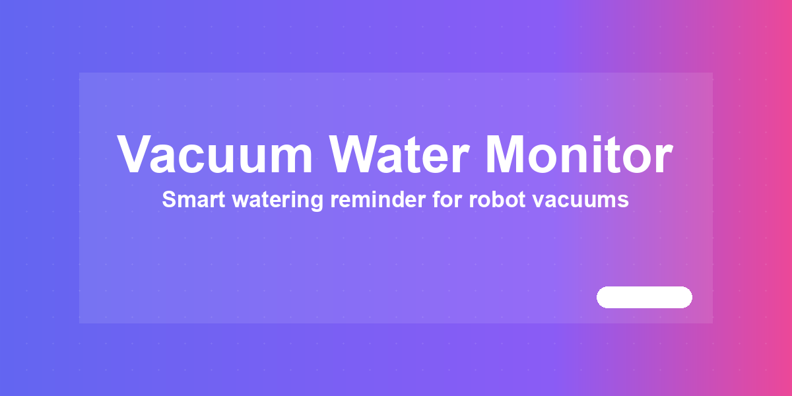
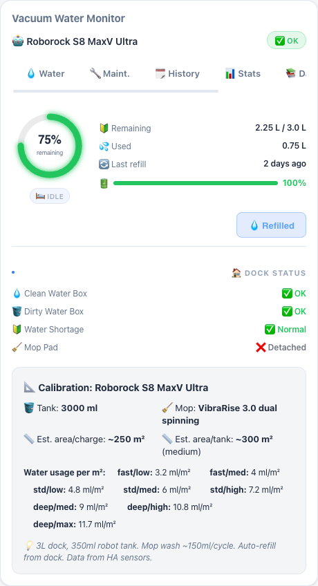
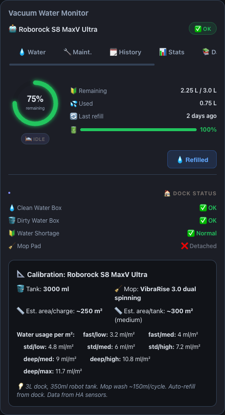
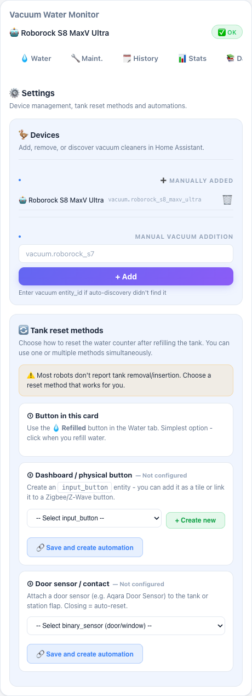

# Vacuum Water Monitor



Track how much water is left in your robot vacuum's mop water tank — and get refill
reminders — without any extra hardware. The integration estimates water usage from what
your vacuum already reports to Home Assistant (machine states, cleaned area, duration,
mode and tank alerts) and exposes
it as sensors plus a bundled dashboard card.

[](https://www.home-assistant.io/) [](LICENSE) [](https://github.com/MacSiem/ha-vacuum-water-monitor/releases)

## Check your model and help improve the consumption database

We are building **Vacuum Consumption Data**, a separate open dataset for model-specific
water and detergent consumption. Check the [current coverage and contribution guide](docs/consumption-database.md)
to see what is known about your robot, inspect the sources and report missing or incorrect data.
The published [Vacuum Consumption Data repository](https://github.com/MacSiem/vacuum-consumption-data)
contains the versioned dataset; use its [contribution guide](https://github.com/MacSiem/vacuum-consumption-data/blob/main/CONTRIBUTING.md)
for sanitized submissions.

Contributions for any model are welcome: a documented setting, a corrected source or a
measured cycle can improve coverage. We distinguish **mop-only, simultaneous vacuum-and-mop,
vacuum-then-mop, route, mopping area, water intensity, passes and mop-washing settings**,
including which combinations the robot actually permits. A profile for one combination
does not prove another combination has the same consumption.

An LLM can help organize sanitized sensor/statistics exports and propose estimates from
measured examples. Area/time alone cannot determine millilitres: a measured water amount
or verified applicable rate is still needed. See the [LLM-assisted contribution instructions](docs/llm-assisted-contribution.md).
Do not share raw private Diagnostics. Proposed estimates are reviewed before becoming shared profiles.

### What a number means

Every value is labelled by its evidence: **Measured**, **Manufacturer data**, **Derived
estimate** or **Unknown**. A recognized model ID, tank capacity or integration name does
not by itself prove a per-cycle consumption value. See the [model support and evidence
matrix](docs/model-support-matrix.md) for detection, available data, estimate scope and
calibration limits, plus a privacy-safe partial-session template.

## How water estimates work (5.7 beta)

The integration always starts from the best data available for your model and then corrects
itself on your robot:

1. **Model database.** Each model record carries its tank capacities and a mop system (pad,
   rotating pads or roller). Water use is estimated from what Home Assistant reports: cleaned
   area per route and water level, and every dock mop-wash sequence.
2. **Labelled basis and accuracy.** Each estimate says what it is based on, from most to least
   specific: learned from calibrated robots of the same model, an owner's measured accounting
   on that model, manufacturer or review data, a closely related model, the typical values for
   the mop system, or a generic mopping estimate. Each basis has a fixed starting accuracy
   (±15% to ±65%).
3. **Automatic calibration.** When the dock reports an empty clean-water tank, the prediction
   for that tank is compared with the tank capacity. The median of recent tanks becomes the
   robot's correction. Until three tanks are learned, a tank far outside the estimate's accuracy
   (a tank lifted mid-cycle, a top-up nobody reported) waits for the next tank to confirm it;
   after that an abnormal tank is ignored. A tank whose signals were missing for more than a
   short, bridgeable gap does not teach the robot. An estimated dock tank is closed at capacity
   minus a 5% unusable residual (the water the pump cannot draw). The accuracy shown narrows as
   tanks agree; the last results are in Diagnostics.
4. **Your data wins.** A volume sensor or your own calibration replaces the estimate.
5. **No mopping, no water.** A run with the water level off or the mop detached uses no water.
   A robot that exposes no signal showing when it mops asks you to map one instead of showing
   a full tank.

The method was chosen on an independent physics benchmark (tests/test_estimation_benchmark.py):
with the owner-device estimate a pad robot reaches about ±3–4% median error (P90 about ±7–11%)
from the fourth tank, and a roller robot that starts from the wrong class recovers to about ±5%.
With 15% of tanks anchored at the wrong point, the confirmation step keeps the second and third
tank within about ±14% at P90 instead of ±46%. These are simulation results for method
quality, not a guarantee for a specific robot.

### Refill options

Every option marks the tracked tank full and they can be combined (⚙️ Settings → *Tank reset
methods*):

| Option | How |
|---|---|
| **Refilled** button | Press it in the Water tab after filling the tank. |
| Automatic from the dock | On by default when the dock reports an empty clean-water tank: the error clearing counts as a refill. Switch it off if that error sometimes clears without a refill. |
| Dashboard or physical button | Pick an `input_button` or `button` entity; pressing it marks the tank refilled. |
| Tank lid or door sensor | Pick a contact sensor; closing it counts as a full refill. |
| Automation or script | Call `ha_vacuum_water_monitor.mark_refilled` with the vacuum as target. |

```yaml
action: ha_vacuum_water_monitor.mark_refilled
target:
  entity_id: vacuum.roborock_s8_maxv_ultra
```

Pressing **Refilled** while the dock still shows its empty-tank error keeps the tank full; the
error clearing later is not counted a second time. The *Last refill* sensor shows what reported
each refill. Refill methods created by versions before 5.7 generated automations that only reset
DIY helpers; the card offers to remove them.

## How it works

**The card labels measured volume separately from calibrated estimates.** After you
install the integration and add the card, press **💧 Refilled** while the tracked reservoir
is full. Until that refill baseline exists, remaining water and water used intentionally
stay **unknown** rather than displaying a fabricated 100% full tank.

What happens under the hood:

1. **Auto-discovery.** The integration finds every `vacuum.*` entity in your Home Assistant
   and creates a device with water sensors for each robot. No YAML, no entity picking.
2. **Water accounting runs server-side when a bound entity changes** (status, cleaned area, dock
   error, mop settings, refill button or lid), with a 60-second heartbeat as a fallback. A gap of
   up to 5 minutes in the robot's signals is bridged from the cumulative area counter when the
   mop settings are unchanged and the cleaned area kept pace with the robot. It prefers
   cleaned-area deltas,
   then a separately calibrated duration/active-time interval. A configured same-reservoir volume sensor takes precedence over both. Mode, intensity, mop/tank
   attachment and dock-wash signals are applied only when their integration exposes a
   canonical machine key. There is no friendly-name or translated-label guessing.
3. **Tank capacity and signals come from the Home Assistant device descriptor.** The
   integration resolves the canonical model profile from registry identifiers and only
   discovers status/area/time/mop signals belonging to that same device. A separate
   Roborock dock is linked only when manufacturer, model prefix and config entry match one
   unambiguous registry device. If capacity is
   unknown, the sensor shows "unknown capacity" instead of a misleading percentage — you
   can set it in the card's ⚙️ Settings tab.
4. **Refills and calibration anchors.** Press **Refilled** after filling the tracked
   reservoir. Exact machine-readable `empty` states may close a calibration cycle.
   Threshold-style low-water alerts require repeated observations and plausible prior
   usage; an early or unavailable alert never rewrites the counter. The low-water
   reserve has no assumed default: its measured threshold and reservoir must be explicit.
5. **Everything is stored by Home Assistant** (Store, included in backups) — counters
   survive restarts and work across all your devices and browsers.

### What is automatic vs. manual

| Automatic | Manual (optional) |
|---|---|
| Discovering vacuums | Pressing **Refilled** after you fill the tank |
| Water usage estimation for every recognised model (labelled estimate + automatic calibration) | Your own measured ml/m² or tank size, which replace the estimate |
| Detecting a refill when the dock's empty-water error clears (can be switched off) | Pressing **Refilled**, a bound button, a tank lid sensor or the `mark_refilled` action |
| Tank capacity for known models | Wiring extra sensors (dock errors, tank door) |
| Sensors + card registration | Maintenance schedule entries |

> **Labelled estimates that calibrate themselves.** Most robot vacuums do not report actual
> water volume. A recognised model therefore starts from a labelled estimate (see below) and
> learns its own correction from the dock's empty-water signal. Every number shows where it
> came from and how accurate it is. A value with no basis at all (an unrecognised model with
> no capacity) is never invented: Unknown remains unknown.

### Manual-only models and the refill baseline

Some models expose a trustworthy clean-water capacity but no usable consumption profile.
They remain **Manual-only** until you add a calibration. When an integration does not
expose the exposure required by that calibration, automatic accounting remains unknown;
the card does not invent an area-to-time conversion. The Diagnostics section shows the
adapter, resolved profile, signal roles, estimate source, uncertainty and calibration
anchor.

### Integration signal compatibility

Automatic discovery uses versioned, per-integration machine contracts. The complete
status, entity-key, unit and fail-closed matrix is documented in
[Integration signal contracts](docs/integration-signal-contracts.md).

| Integration | Signals used when available | Important limitation |
|---|---|---|
| Roborock | status, in-cleaning, area, duration, mop mode/intensity, attachments, shortage and dock state | Binary clean-box alerts are not treated as exact volume because they can also mean missing/transient refill state. |
| Xiaomi Miio | current clean area/time, mop/tank attachment and no-water/shortage | HA Core's generic Xiaomi `water_level` sensor is not a vacuum entity and is deliberately excluded. |
| Xiaomi Home / Xiaomi MIoT (custom) | status, cleaning area/time, mop water-output level, mop status, robot and dock tank status | These integrations name entities after canonical MIoT properties rather than a Home Assistant `translation_key`, so roles are matched on the property and the longest match always wins. Newer models such as the H50 and H50 Pro publish no water-consumption rate, so automatic estimation still needs a measured calibration. |
| Ecovacs | stats area/time, water amount, work mode, mop attached and station state | Generic error text is diagnostic only, never a water-volume anchor. |
| Matter RVC | vacuum activity, clean mode and operational error when Home Assistant exposes them | No area is required: supported model profiles use bounded active time, but only while `clean_mode` explicitly proves mopping. Missing or vacuum-only mode fails closed. |
| iRobot Roomba/Braava | mission area/time attributes, tank-present and spray mode; tank percentages are discovered | Generic tank percentages are not used as clean water until a model profile confirms their semantics. |
| SmartThings | water-spray level and cleaning type | Spray level is an intensity, not liters or percent. |
| TP-Link | clean area/time | Current HA Core does not expose the vacuum mop features, so an explicit mop gate/calibration or usable Matter clean mode is still required. Generic TP-Link leak alerts are ignored. |
| Dreame Vacuum (custom) | preferred `state`, area/time, water volume, cleaning mode, mop/tank and self-wash base state | `state` distinguishes washing from ordinary cleaning; temporarily unavailable dynamic entities keep their exact registry binding but are never consumed while unavailable. |
| Valetudo MQTT | retained area/time, mode/water, attachments and clean/dirty tank enums | Area is normalized from cm². `empty` is an exact anchor; `missing` means absent hardware and never means consumed water. |
| SwitchBot, Shark IQ, Miele, generic MQTT | only explicitly exposed/configured machine signals | No water telemetry is inferred from a generic `cleaning` state or entity name. |

### Mapping signals by hand

Automatic discovery fails closed: an integration this build has never seen, or
two equally plausible candidates for the same measurement, leave the role
unassigned rather than guessing a consumption figure. When that happens the card
shows a **Signal mapping** section under *Settings*, listing every entity that
belongs to the same Home Assistant device together with its `device_class` and
unit, so the role can be assigned by hand.

A manual assignment always wins over automatic detection, and selecting
*Automatic* hands the role back. Only a genuine correction is stored, so
confirming what discovery already found does not pin the role and the device
keeps benefiting from future detection improvements. Roles where several
candidates ranked equally are flagged for confirmation instead of being dropped
silently.

## Screenshots

| Light | Dark |
|---|---|
|  |  |

*The Water tab: estimated tank level, usage since refill, and the Refilled button. Dark
mode follows your Home Assistant theme automatically.*



*Vacuums are auto-discovered — the ⚙️ Settings tab lets you add discovered robots, tune
calibration, and manage the maintenance schedule.*

## Installation

1. Open HACS → Custom repositories.
2. Add `https://github.com/MacSiem/ha-vacuum-water-monitor` as category **Integration**.
3. Install **Vacuum Water Monitor**.
4. Restart Home Assistant.
5. Go to Settings → Devices & services → Add integration, then search for
   **Vacuum Water Monitor**.

The integration registers the bundled Lovelace card automatically — you do not need to add
a Lovelace resource manually.

## Quick start

Add the card to any dashboard:

```yaml
type: custom:ha-vacuum-water-monitor
```

That's it. The card lists every discovered vacuum. When the tracked reservoir is full,
press **💧 Refilled** once to set the baseline. Before that, water remaining and used are
unknown by design.

> **Tip:** add the card (or press Refilled) when the tank is actually full, so tracking is
> accurate from the start.

## Entities for automations

Each discovered vacuum gets its own device with these sensors:

| Sensor | Unit | Entity category | Meaning |
|---|---:|---|---|
| Water remaining | `%` | normal | Estimated water left in the tank |
| Water used since refill | `mL` | normal | Usage accumulated since the last refill |
| Last refill | timestamp | diagnostic | When the tank was last refilled; attributes show what reported it and recent refills |
| Next maintenance due | `d` | diagnostic | Days until the next custom maintenance item |

Use them like any other sensor — dashboards, template sensors, and automations.

**Low-water phone notification:**

```yaml
alias: Vacuum water below 15 percent
trigger:
  - platform: numeric_state
    entity_id: sensor.roborock_s8_maxv_ultra_water_remaining
    below: 15
action:
  - service: notify.mobile_app_phone
    data:
      title: Vacuum water low
      message: >-
        {{ state_attr(trigger.entity_id, 'vacuum_entity') }} has
        {{ states(trigger.entity_id) }}% water remaining
        ({{ state_attr(trigger.entity_id, 'remaining_ml') }} mL).
mode: single
```

**Maintenance reminder:**

```yaml
alias: Vacuum maintenance due tomorrow
trigger:
  - platform: numeric_state
    entity_id: sensor.roborock_s8_maxv_ultra_next_maintenance_due
    below: 2
action:
  - service: notify.mobile_app_phone
    data:
      title: Vacuum maintenance
      message: >-
        {{ state_attr(trigger.entity_id, 'next_item') }} is due in
        {{ states(trigger.entity_id) }} day(s).
mode: single
```

## Configuration (optional)

Everything below is optional — the defaults work out of the box.

```yaml
type: custom:ha-vacuum-water-monitor
title: Roborock
vacuum_entity: vacuum.roborock_s8_maxv_ultra
area_sensor: sensor.roborock_s8_maxv_ultra_cleaning_area
dock_error_sensor: sensor.roborock_s8_maxv_ultra_dock_error
warning_threshold: 20
critical_threshold: 10
```

### Extra sensor hooks

These optional keys let you wire additional entities into the water accounting
(used by both the card and the server-side integration):

| Option | Example | What it does |
|---|---|---|
| `status_sensor` | `sensor.roborock_..._status` | Dedicated status entity used instead of the vacuum's `status` attribute (or its state). Drives mop-wash detection only when the resolved model or user calibration provides a wash volume, and the "cleaning" check for area-based dosing. |
| `cleaning_active_sensor` | `binary_sensor.robot_..._in_cleaning` | Canonical activity flag used when the vacuum state lags. |
| `area_sensor` | `sensor.robot_..._cleaning_area` | Cumulative current-session area. Resets and implausible jumps are rejected. |
| `duration_sensor` | `sensor.robot_..._cleaning_time` | Cumulative session duration used only when area is unavailable. Units from Home Assistant are normalized. |
| `mop_mode_entity` | `select.roborock_..._mop_mode` | Current mop mode (`fast` / `standard` / `deep`). Selects a resolved per-m² model/user calibration rate. Mode `off` disables area-based dosing entirely; an unavailable mode cannot manufacture a rate. |
| `mop_intensity_entity` | `select.roborock_..._mop_intensity` | Current mop intensity / water level. Documented three- and five-level option tokens are mapped to/interpolated between the profile's low/medium/high bands. Ranged number entities use their own HA min/max, so model-specific scales are not guessed. Unknown options use only an explicit profile default. |
| `cleaning_mode_entity` | `select.robot_..._cleaning_mode` | Prevents water accounting during canonical vacuum-only/dry modes. |
| `mop_attached_sensor` / `water_box_attached_sensor` | `binary_sensor.robot_..._mop_attached` | Stops automatic dosing when the mop or tank is absent. Inverted detached signals are handled separately. |
| `water_shortage_sensor` | `binary_sensor.robot_..._water_shortage` | Debounced low-water threshold used as an estimated calibration anchor after plausible prior usage. |
| `dock_clean_water_sensor` / `dock_dirty_water_sensor` | `sensor.robot_..._water_tank_clean` | Uses canonical enum semantics. `missing` is never treated as consumption. |
| `dock_status_sensor` | `sensor.robot_..._station_state` | Detects one dock mop-wash cycle without confusing robot cleaning with dock cleaning. |
| `water_error_sensor` | `sensor.robot_..._operational_error` | Accepts only exact machine-readable clean-water-empty states. |
| `reset_door_sensor` | `binary_sensor.roborock_..._water_tank` | Tank-lid / door binary sensor. Closing it counts as a full refill (the same choice as the card's lid option). |

### Advanced — bring your own counter

If you already maintain your own water counter (DIY template sensor or automation updating
an `input_number`), wire it in and the integration will skip its own accounting and only
display your data:

```yaml
type: custom:ha-vacuum-water-monitor
vacuum_entity: vacuum.roborock_s8_maxv_ultra
water_used_input: input_number.roborock_water_used_ml
water_sensor: sensor.roborock_water_remaining              # optional template
last_session_sensor: sensor.roborock_water_used_last_session  # optional
last_reset_entity: input_datetime.roborock_last_water_reset   # optional
```

## FAQ

**Do I have to configure anything?**
No. Install → add integration → add card → press Refilled when the tank is full.

**Why is "Water remaining" unknown?**
First press **Refilled** with the tracked reservoir full. Before that baseline, both water
sensors intentionally stay unknown even when the model and its capacity were detected.
If Diagnostics says `unknown_capacity`, set the tank size in ⚙️ Settings → calibration
(and feel free to open an issue with your model + tank size so we can add it). If it says
`awaiting_refill`, the model is already recognized and only the baseline is missing.

**Why is "Next maintenance due" unknown?**
That diagnostic sensor has no truthful numeric value until at least one maintenance item
has been scheduled. Add a maintenance interval in the card settings; `unknown` before
that means “no schedule”, not a failed vacuum detector.

**I see two devices but I only have one vacuum.**
Duplicate entities are grouped automatically only with a shared registry device identity or a matching non-placeholder MAC. It preserves one history owner and never adds histories together. A robot shared over **Matter** and also added through its vendor integration cannot be proven identical from the registry: when it is the only robot of that maker, the card asks *"… looks like the same robot as … Hide the duplicate?"*. **Hide duplicate** removes the Matter copy's sensors and accounting (the native robot keeps its history); **It is another robot** keeps both. A hidden duplicate is listed in the card with **Show** to undo. On older releases, your robot may be exposed by two integrations at once (e.g. the vendor integration and
Matter — each creates its own `vacuum.*` entity), or you hit a bug fixed in v5.1.7 where a
ghost "Vacuum" device could be created by the card's default config. Update and restart —
the ghost is removed automatically. If it persists, remove it in Settings →
Devices & services.

**The dock shows as a separate device in Home Assistant — does it affect this?**
A separate Roborock dock can be used when the device registry gives one unambiguous match:
same manufacturer, matching robot-model prefix and a shared config entry. Otherwise the
link fails closed and the dock is ignored instead of borrowing signals from another robot.

**How accurate is it?**
Accuracy requires physical comparison for the same reservoir, model and mode. There is
no accuracy percentage without measurements. Configure measured ml/m² or ml/min;
whole-cycle calibration includes dock washes, so separate wash dosing is enabled only
with `calibration_scope: floor_only`. Low-water calibration also requires explicit
reservoir semantics and a measured remaining threshold.

## Upgrading from v4

v4 was a HACS Lovelace plugin. v5 is a HACS integration.

1. In HACS, remove the old frontend/plugin installation if it is still present.
2. Remove any manual Lovelace resource pointing at
   `/local/community/ha-vacuum-water-monitor/ha-vacuum-water-monitor.js`.
3. Add this repository back to HACS as category **Integration**.
4. Restart Home Assistant and add the integration from Devices & services.
5. Keep the same Lovelace card YAML: `type: custom:ha-vacuum-water-monitor`.

Browser-only v4 tank counters are not automatically imported. After installing v5, press
**Refilled** once when the tank is full to establish the server-side baseline.

## Privacy

- No telemetry, analytics, or tracking. Nothing is sent automatically.
- No CDN-hosted assets.
- No maps, room names, entity states or registry identifiers leave Home Assistant.
- **Optional calibration sharing (off by default).** In ⚙️ Settings → *Help improve estimates*
  you can enable a calibration summary for your robot model. The card then shows the exact
  JSON: model, mop system, integration, tank capacity (rounded), correction factor and
  per-tank results (rounded). It never contains entity or device names, identifiers, account
  data, timestamps, rooms, maps, areas or firmware. You copy it or submit it yourself through
  a public GitHub issue, which shows your GitHub username. Turning the option off hides it again.
- Tank state is stored locally by Home Assistant in its normal storage area and is included
  in Home Assistant backups.

## Changelog

See [CHANGELOG.md](CHANGELOG.md).

## Support

- [Buy Me a Coffee](https://buymeacoffee.com/macsiem)
- [PayPal](https://www.paypal.com/donate/?hosted_button_id=Y967H4PLRBN8W)

## License

MIT, see [LICENSE](LICENSE).

## Evidence-gated catalog and diagnostics (unreleased)

See [dated per-model and per-integration coverage](docs/coverage-report-2026-09-05.md),
[measurement and Diagnostics instructions](docs/diagnostics-and-calibration.md), and
[the sprint ledger](docs/app-sprint-ledger.json). The catalogue lists researched candidates,
not a promise of hardware-verified support for every SKU.

The panel now keeps bounded automatic session history (50 sessions), preserves unknown
water values, and offers **Refresh detected profile** in Maintenance → Custom calibration.
This releases profile locks while preserving authored settings, calibration and history.

For an actual volume sensor configure `water_volume_sensor`, its
`water_volume_reservoir`, and matching `tracked_reservoir`. Only mL/L are accepted;
percent, mode enums and an unknown sensor unit cannot masquerade as volume. The legacy
card-only `water_sensor` never overrides backend accounting; migrate real input sensors
to these explicit fields. Measurement gaps fail closed instead of falling back to estimates.

### Consumption research status (2026-09-05)

Universal per-model/per-mode consumption remains incomplete. Published action quantities, public MIoT settings and unresolved integration bindings are tracked in [the consumption research report](docs/consumption-research-2026-09-05.md). They are not automatically promoted to runtime rates. `python3 scripts/check_consumption_coverage.py --require-complete` is the separate acceptance gate; passing local tests does not imply this gate passes.

### Runtime selection and private measurements

The replacement sprint adds strict context-based consumption selection, historical context,
private measured calibration, independent reservoir readings and explicit accuracy diagnostics.
See [runtime contract and limitations](docs/runtime-consumption-contract.md). The shipped
snapshot still has no approved consumption profiles; local tests do not establish worldwide
coverage or physical accuracy. Production HA has not been modified by this sprint.
